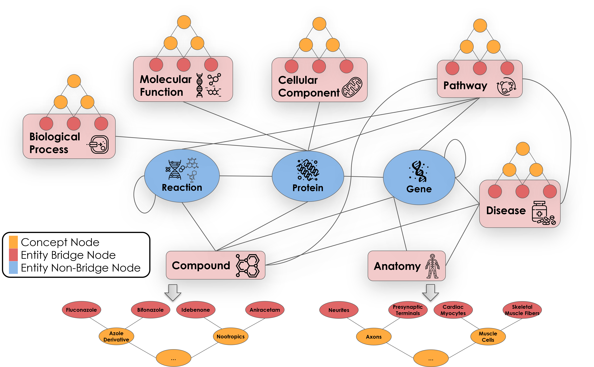

<p align="center">
  
</p>

------------------------------------------------

# Know2BIO

Know2BIO is a comprehensive biomedical knowledge graph benchmark harmonizing heterogeneous database sources.

```
To NeurIPS reviewers:

We mistakenly submitted our final rebuttal revision to the "supplemental materials" instead of the main "pdf". Please check the version in the supplemental.

Sorry about any inconvenience caused. Thanks.
```

## Getting Started
### Environment Setup
We recommend using Anaconda3 to manage the environment.
- Install Anaconda3.
- Edit `env.yaml`: set $USER_PATH to user's directory.
- Create `know2bio` environment using `conda env create -f env.yml`.

### Hardware Requirements
- Server: AMD EPYC 7542 Processor (128 cores), 1.73 TB RAM, and 8 NVIDIA A100-SXM4-80GB GPUs.
- Operating system: Ubuntu 20.04 LTS.


## Benchmarking
### Setup
- Python environment: follow the guide in `Environment Setup` Section.

### Experiments
- To run the experiments, please excute `main.py` script. Arguments are listed below.
```
usage: run.py [-h] [--dataset {ontology,instance,whole,FB15K,WN,WN18RR,FB237,YAGO3-10}]
              [--model {TransE,TransR,DistMult,CP,MurE,RotE,RefE,AttE,RotH,RefH,AttH,ComplEx,RotatE}] [--regularizer {N3,F2}] [--reg REG]
              [--optimizer {Adagrad,Adam,SparseAdam}] [--max_epochs MAX_EPOCHS] [--patience PATIENCE] [--valid VALID] [--rank RANK] [--batch_size BATCH_SIZE] [--neg_sample_size NEG_SAMPLE_SIZE]
              [--init_size INIT_SIZE] [--learning_rate LEARNING_RATE]

Knowledge Graph Embedding

options:
  -h, --help            show this help message and exit
  --dataset {ontology,instance,whole}
                        Knowledge Graph dataset: ontology, instance, whole views
  --model {TransE,TransR,DistMult,CP,MurE,RotE,RefE,AttE,RotH,RefH,AttH,ComplEx,RotatE}
                        Knowledge Graph embedding model
  --optimizer {Adagrad,Adam,SparseAdam}
                        Optimizer
  --max_epochs MAX_EPOCHS
                        Maximum number of epochs to train for
  --patience PATIENCE   Number of epochs before early stopping
  --valid VALID         Number of epochs before validation
  --rank RANK           Embedding dimension
  --batch_size BATCH_SIZE
                        Batch size
  --neg_sample_size NEG_SAMPLE_SIZE
                        Negative sample size, -1 to not use negative sampling
  --dropout DROPOUT     Dropout rate
  --init_size INIT_SIZE
                        Initial embeddings' scale
  --learning_rate LEARNING_RATE
                        Learning rate
```

- Example: Train TransE model on Know2BIO's whole view
```bash
CUDA_VISIBLE_DEVICES=0 python main.py --model TransE --dataset whole --valid 10 --patience 5 --rank 512 --neg_sample_size 150 --optimizer Adam --learning_rate 0.001
```

Code and README for the benchmarking Know2BIO can be found in [**benchmark**](./benchmark).

## Dataset Construction
### Dataset Schema


### Data Source and Relationships


### Usage and Datasheet
Code and README for the construction of Know2BIO can be found in [**dataset**](./dataset).
